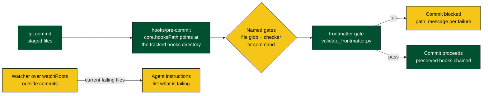

# bb-plugin-hooks

Durable Git hook gates for BB-managed repositories.

The plugin owns a tracked hook directory at `hooks/`. Repositories can point
`core.hooksPath` at that directory without depending on temporary migration
checkouts.

## How it works



## Design

- Gates are named validators with a file glob and either a built-in checker or
  command.
- The first gate is `frontmatter`, which validates staged Markdown files with
  `hooks/validate_frontmatter.py`.
- `hooks/pre-commit` blocks commits and chains any preserved hooks.
- The watcher only detects failures outside commits. It logs failures and
  contributes agent instructions listing current failing files.

## Commands

```sh
bb hooks install <repo-path>
bb hooks uninstall <repo-path>
bb hooks status
bb hooks gates
bb hooks check [--staged] <path>
```

## Install

From this directory:

```
bb plugin install .
```

After editing sources:

```
bb plugin reload hooks
```

## Configure

```
bb plugin config hooks
bb plugin config hooks set watchRoots "$HOME/kbs/sirven-kb,$HOME/kbs/jefferson"
bb plugin config hooks set watcherEnabled true
```

## Adding A Gate

Add a gate definition in `src/gates.ts` and, if the commit-time hook needs to
run it without the BB server, add the matching command to `hooks/gates.json`
and the hook dispatcher. A future `secrets-scan` gate would add a named gate,
a file glob such as `**/*`, and a command that exits non-zero with one
`path: message` line per failure.

## Checks

```sh
npm test
npx tsc --noEmit
```
